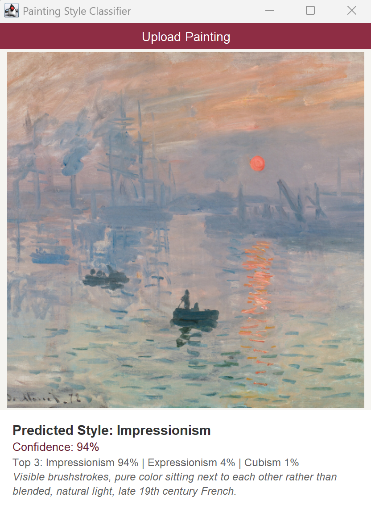

# Painting Style Classifier

A convolutional neural network built from scratch in Java with DeepLearning4J
that classifies paintings into seven art historical styles. Trained on ~14,700
WikiArt images with no pretrained weights or transfer learning, it reaches
**51.4% accuracy on the test set**, against a 14.3% random baseline for seven
classes. The project includes the full pipeline: a Python script that scrapes,
cleans and balances the dataset, the CNN itself, and a Swing desktop app for
classifying individual paintings.

## Demo



*Monet's* Impression, Sunrise *classified with 94% confidence.* Impressionism is
the model's strongest class.


## Styles

The model distinguishes seven styles. Class indices are assigned
alphabetically by folder name, which is the order DL4J's
`ParentPathLabelGenerator` uses:

| # | Style | Characteristics |
|---|---|---|
| 0 | Baroque | Dramatic contrast between light and shadow, rich deep colors. 17th century European. |
| 1 | Cubism | Geometric fragmentation, flat planes without depth gradients. Early 20th century. |
| 2 | Expressionism | Distorted forms, unnatural colors, emotional intensity. Early 20th century. |
| 3 | Impressionism | Visible brushstrokes, unblended color placed side by side, natural light. Late 19th century French. |
| 4 | Renaissance | Smooth blending, dark backgrounds, religious composition. 14th–17th century. |
| 5 | Romanticism | Dramatic landscapes dwarfing human figures, emotional subjects. Early 19th century. |
| 6 | Surrealism | Technically realistic rendering of impossible imagery. 20th century. |


## Dataset

~14,700 paintings from the [WikiArt dataset on Kaggle](https://www.kaggle.com/datasets/steubk/wikiart),
split 70/15/15 into training, validation and test sets.

| Split | Images per class | Total |
|---|---|---|
| Train | ~1,470 | 10,281 |
| Validation | ~315 | 2,196 |
| Test | ~320 | 2,252 |

Classes are balanced to within 2% of each other, so the accuracy and macro-F1
figures below aren't inflated by a dominant class.

The dataset itself is not in this repository. Generate
it by running `dataset_prep/prep_data.py`, which handles the whole pipeline:

1. **Downloads the Surrealism class** from `surrealism.csv`, a list of ~3,600
   WikiArt image URLs ( https://www.kaggle.com/datasets/antoinegruson/-wikiart-all-images-120k-link). The original source had no Surrealism folder.
2. **Merges three Renaissance folders** (Early, High, and Northern) into a
   single class, prefixing filenames to avoid collisions.
3. **Supplements Cubism** with Picasso paintings from
   [Best Artworks of All Time](https://www.kaggle.com/datasets/ikarus777/best-artworks-of-all-time), manually
   since the main source didn't have enough.
4. **Cleans**: drops non-image files, anything under 5 KB or over 5 MB, and
   files PIL can't open. Converts everything to RGB.
5. **Removes duplicates** using perceptual hashing (`imagehash.phash`), which
   compares pixel content rather than filenames, so the same painting
   downloaded twice under different names is still caught.
6. **Balances** each class down to a common target by random removal.
7. **Splits** into train/validation/test.

Requires `requests`, `Pillow` and `imagehash`.

- The split is seeded (`random.seed(42)`) so the partition is reproducible.
Note that the included model was trained before seeding was added, so its
exact split can't be reconstructed, retraining from a fresh run of the
script will produce slightly different numbers.


## Architecture

A CNN built from scratch in DL4J, no pretrained weights or transfer learning.

**Input:** 128×128×3 RGB

**Feature extraction**: four convolutional blocks, each a 3×3 convolution
(stride 1, padding 1) with ReLU, followed by 2×2 max pooling:

| Block | Filters | Output |
|---|---|---|
| 1 | 32  | 64×64 |
| 2 | 64  | 32×32 |
| 3 | 128 | 16×16 |
| 4 | 256 | 8×8 |

**Classifier head:**
- Global average pooling, collapses each of the 256 feature maps to a single
  value, replacing the usual flatten step. This cuts the parameter count
  dramatically: the model file is 4.9 MB rather than ~95 MB.
- Dense layer, 256 units, ReLU, L2 regularization (1e-4)
- Dropout, rate 0.5
- Output layer, 7 units, softmax

**Training:**
- Loss: multi-class cross-entropy (MCXENT)
- Optimizer: Adam, learning rate 0.001 with exponential decay (0.95 per epoch)
- Weight init: ReLU (He)
- Batch size: 32, 30 epochs
- Augmentation on the training split only: horizontal flip, ±15° rotation,
  and random 120×120 crop, each applied with probability 0.5


## Results
Evaluated on the held-out test set (2,252 images):

```
========================Evaluation Metrics========================
 # of classes:    7
 Accuracy:        0.5138
 Precision:       0.5121
 Recall:          0.5154
 F1 Score:        0.5083
Precision, recall & F1: macro-averaged (equally weighted avg. of 7 classes)
```
Random guessing across seven balanced classes would give 14.3%.

Rows are the true style, columns the prediction:
```
=========================Confusion Matrix=========================
   0   1   2   3   4   5   6
-----------------------------
 198   2   7   7  26  61   9 | 0 = Baroque
   7 180  60  19  14   6  34 | 1 = Cubism
  13  62 130  53  22  21  23 | 2 = Expressionism
  12   7  26 220  10  40   8 | 3 = Impressionism
  52   3  25  24 189  15   9 | 4 = Renaissance
  74   1  18  53  33 140  14 | 5 = Romanticism
  18  85  52  28  12  30 100 | 6 = Surrealism

Confusion matrix format: Actual (rowClass) predicted as (columnClass) N times
==================================================================
```


The errors are not random. Almost every major confusion falls between styles
that are adjacent in art history:

- **Surrealism is weakest** (100/325 correct), with 85 images going to Cubism
  and 52 to Expressionism. This class came from a different source than the
  rest and is stylistically the broadest; Chagall, Arp and Dalí share a label
  but little visual vocabulary.
- **Baroque and Romanticism trade heavily in both directions** (74 and 61).
  Both favour dark palettes, dramatic lighting and overlapping subject matter.
- **Renaissance is most often mistaken for Baroque** (52), which is the
  neighbouring period with similar religious composition.
- **Impressionism is strongest** (220/323). Visible brushwork is a distinctive
  texture that a convolutional network picks up easily.

That the confusions cluster around genuine art historical boundaries suggests
the network learned something about style rather than memorising artefacts of
the dataset.


## Setup and Usage

Requires Java 11+, Maven, and Python 3 for dataset preparation. CPU only, no
GPU needed. If Maven isn't on your PATH, use IntelliJ's Maven panel instead.

```bash
git clone https://github.com/yagmur-cam/painting-classifier-cnn.git
cd painting-classifier-cnn
mvn compile
```

The trained model is included, so you can predict or evaluate immediately.
To train from scratch you need the dataset; see above.

| Command | What it does |
|---|---|
| `mvn exec:java -Dexec.args="ui"` | Launch the desktop app |
| `mvn exec:java -Dexec.args="predict path/to/painting.jpg"` | Classify one image |
| `mvn exec:java -Dexec.args="evaluate"` | Score the test set |
| `mvn exec:java -Dexec.args="train"` | Retrain (several hours on CPU) |


## Project structure
```
painting-classifier-cnn/
├── README.md
├── pom.xml                          Maven build config and DL4J dependencies
├── .gitignore
├── painting-classifier-model.zip    Trained model (4.9 MB)
├── dataset_prep/
│   ├── prep_data.py                 Dataset download, cleaning, balancing, splitting
│   └── surrealism.csv               WikiArt URLs for the Surrealism class
├── dataset/                         Not in the repo, generated by prep_data.py
│   ├── train/                       7 style folders
│   ├── validation/                  7 style folders
│   └── test/                        7 style folders
├── docs/                            README screenshots
└── src/main/java/org/example/
    ├── DataLoader.java
    ├── Evaluator.java
    ├── Main.java
    ├── ModelBuilder.java
    ├── PaintingClassifierUI.java
    └── Trainer.java
```


| File                   | Purpose                                                                                                                                                                                                                  |
|------------------------|--------------------------------------------------------------------------------------------------------------------------------------------------------------------------------------------------------------------------|
| `DataLoader.java`      | 	Builds DataSetIterators from the split folders. Resizes to 128×128, scales pixels to 0–1, and applies flip/rotate/crop augmentation to the training split only. Labels come from folder names, assigned alphabetically. |
| `ModelBuilder.java`    | 	Defines the CNN: 4 convolution blocks (32→64→128→256) with max pooling, global average pooling, a 256-unit dense layer, dropout, and a 7-class softmax output.                                                          |
| `Trainer.java`         | Runs the training loop for 30 epochs, reporting validation accuracy each epoch, then saves the model and prints final test metrics.                                                                                      |
| `Evaluator.java`       | Loads the saved model. Scores the test set, or predicts a single image; returning either the top style or the full probability vector.                                                                                   |
| `Main.java`            | 	Entry point. Dispatches on a CLI argument: train, evaluate, predict `<image>`, or ui.                                                                                                                                   |
| `PaintingClassifierUI.java` | Swing desktop app. File picker, image preview, predicted style with confidence, top-3 breakdown, and a short description of the predicted style.                                                                         |


## Limitations and future work

**Training had not converged.** Validation accuracy was still climbing at epoch
30 (0.52 → 0.535 over the final few epochs) and test accuracy sat below
validation, so the model was not overfitting. More epochs would likely gain
several points.

**No transfer learning.** The network is trained from scratch on ~10,000 training images. 
Fine-tuning a pretrained ResNet or VGG on the same data would almost
certainly perform substantially better, since low-level visual features
transfer well. Building the architecture from nothing was the point here, but
it caps what the accuracy can be.

**Style labels are inherently fuzzy.** Movements overlap, artists work across
them, and a single painting can reasonably belong to two categories. Some
proportion of the remaining error is disagreement that art historians would
also have.

**Small input resolution.** 128×128 discards fine brushwork detail that is
often exactly what distinguishes one style from another. Higher resolution
would help but costs training time on CPU.

Possible next steps: longer training with early stopping, a pretrained
backbone, higher input resolution, and per-class threshold tuning for
Surrealism.